# RAG系统用户查询处理流程图

这个流程图展示了从前端用户输入到后端AI响应的完整数据流。

```mermaid
flowchart TD
    %% 前端层
    subgraph Frontend["🖥️ 前端层 (Frontend)"]
        A[用户输入查询] --> B[sendMessage函数]
        B --> C[构建POST请求]
        C --> D[禁用UI + 显示加载]
        D --> E[fetch /api/query]
    end

    %% API层
    subgraph API["🔗 API层 (FastAPI)"]
        F[接收POST请求] --> G[验证QueryRequest]
        G --> H[检查/创建会话ID]
        H --> I[调用rag_system.query]
    end

    %% RAG系统层
    subgraph RAG["🧠 RAG系统层"]
        J[构建AI提示] --> K[获取会话历史]
        K --> L[准备工具定义]
        L --> M[调用AI生成器]
    end

    %% AI处理层
    subgraph AI["🤖 AI处理层 (Claude)"]
        N[接收系统提示] --> O[分析用户查询]
        O --> P{需要搜索工具?}
        P -->|是| Q[调用search_course_content]
        P -->|否| R[直接生成回答]
        Q --> S[执行向量搜索]
    end

    %% 数据存储层
    subgraph Storage["💾 数据存储层 (ChromaDB)"]
        T[解析搜索参数] --> U[构建过滤器]
        U --> V[向量相似性搜索]
        V --> W[返回匹配文档]
    end

    %% 响应流
    subgraph Response["📤 响应流"]
        X[合成AI回答] --> Y[构建QueryResponse]
        Y --> Z[返回JSON响应]
    end

    %% 前端响应处理
    subgraph FrontendResponse["🖥️ 前端响应处理"]
        AA[接收JSON响应] --> BB[移除加载动画]
        BB --> CC[Markdown渲染]
        CC --> DD[显示答案和来源]
        DD --> EE[重新启用UI]
    end

    %% 会话管理
    subgraph Session["💬 会话管理"]
        FF[保存对话历史] --> GG[更新会话状态]
    end

    %% 连接线
    E --> F
    I --> J
    M --> N
    S --> T
    W --> X
    Z --> AA
    X --> FF

    %% 数据标注
    E -.->|"JSON: {query, session_id}"| F
    I -.->|"query: str, session_id: str"| J
    M -.->|"prompt + tools + history"| N
    Q -.->|"search_course_content()"| S
    S -.->|"query, course_name, lesson_number"| T
    W -.->|"SearchResults"| X
    Z -.->|"QueryResponse JSON"| AA

    %% 样式
    classDef frontend fill:#e1f5fe
    classDef api fill:#f3e5f5
    classDef rag fill:#e8f5e8
    classDef ai fill:#fff3e0
    classDef storage fill:#fce4ec
    classDef response fill:#f1f8e9

    class A,B,C,D,E,AA,BB,CC,DD,EE frontend
    class F,G,H,I api
    class J,K,L,M,FF,GG rag
    class N,O,P,Q,R ai
    class T,U,V,W storage
    class X,Y,Z response
```



## 关键组件说明

### 数据结构流转

1. **前端请求** (`script.js:68`):
   ```javascript
   {
     query: "用户问题",
     session_id: "会话ID或null"
   }
   ```

2. **API响应** (`app.py:68`):
   ```python
   QueryResponse(
     answer="AI生成的答案",
     sources=["来源列表"],
     session_id="会话ID"
   )
   ```

3. **向量搜索结果** (`vector_store.py:61`):
   ```python
   SearchResults(
     documents=["文档内容"],
     metadata=[{"course_title", "lesson_number"}],
     distances=[相似度分数]
   )
   ```

### 核心功能模块

- **文档处理**: `document_processor.py` - 处理课程文档和分块
- **向量存储**: `vector_store.py` - ChromaDB向量搜索
- **AI生成**: `ai_generator.py` - Claude API集成
- **搜索工具**: `search_tools.py` - 课程内容搜索工具
- **会话管理**: `session_manager.py` - 对话历史管理

### 错误处理机制

- 前端: 显示错误消息，重新启用UI
- API: 返回HTTP 500错误和详细信息
- RAG: 捕获异常，返回错误状态
- 存储: 返回空结果和错误信息

这个流程确保了用户查询的高效处理和可靠的响应生成。